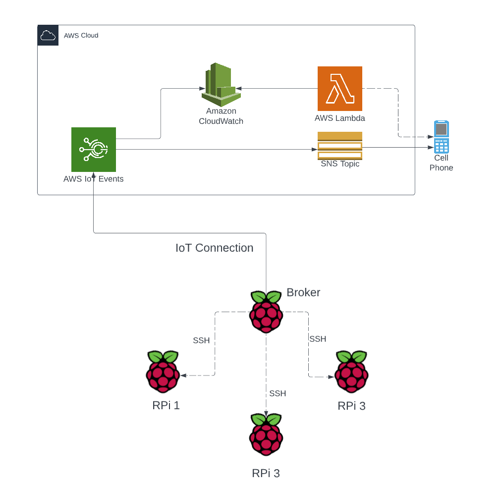

# Overview
A lambda function to monitor IoT activities and notify me via SMS if endpoints stop reporting

As of this writing, there is no good way to tell if an IoT device stops sending periodic notifications to AWS. There 
are ways to tell if an IoT device is broken, but there is not a way to detect that the device hasn't been heard from
in X number of hours.  

This lambda function is meant to fill that need.  It will scan the IoT logs for certain message strings.  If log entries 
with those strings have not been seen in 12 hours, then the function will alert me via a text message. The function 
itself will run once daily.

# Design Diagram


# Technical Description


# Messages 
There are basically two messages sent from the broker.  One has a prefix of "MSG003" and the other has a prefix of 
"MSG004".  THe MSG003 message is to identify errors either on the Raspberry Pi endpoint or trying to connect to the 
endpoint.  MSG004 indicates all endpoints are connected and no errors found.

# Message Routing Rules 
There are two different message routing rules; one each for the two messages (see above). MSG003 messages are all sent to SNS for eventual
sending as a SMS text message.  But, they are also sent to the CloudWatch "AWSIotLogsV2" log group. MSG004 messages (no problems found) are
only sent to the CloudWatch "AWSIotLogsV2" log group. So, no matter what happens, CloudWatch will always get a copy of every message.

# IAM Configuration
In order for the lambda function to operate correctly, it needs certain permissions.  They are as follows:

Log  permissions
```json
{
    "Version": "2012-10-17",
    "Statement": [
        {
            "Sid": "VisualEditor0",
            "Effect": "Allow",
            "Action": [
                "logs:StartQuery",
                "logs:FilterLogEvents",
                "logs:GetLogGroupFields"
            ],
            "Resource": "arn:aws:logs:*:<redacted>:log-group:*"
        },
        {
            "Sid": "VisualEditor1",
            "Effect": "Allow",
            "Action": "logs:GetLogEvents",
            "Resource": "arn:aws:logs:*:<redacted>:log-group:*:log-stream:*"
        },
        {
            "Sid": "VisualEditor2",
            "Effect": "Allow",
            "Action": [
                "logs:GetLogRecord",
                "logs:GetQueryResults",
                "logs:StopQuery",
                "logs:TestMetricFilter",
                "logs:GetLogDelivery"
            ],
            "Resource": "*"
        }
    ]
}
```

SNS Permissions
```json
{
    "Version": "2012-10-17",
    "Statement": [
        {
            "Sid": "VisualEditor0",
            "Effect": "Allow",
            "Action": [
                "sns:PutDataProtectionPolicy",
                "sns:Publish",
                "sns:DeleteTopic",
                "sns:CreateTopic",
                "sns:SetTopicAttributes",
                "sns:Subscribe",
                "sns:ConfirmSubscription"
            ],
            "Resource": "arn:aws:sns:*:<redacted>:*"
        },
        {
            "Sid": "VisualEditor1",
            "Effect": "Allow",
            "Action": [
                "sns:DeleteSMSSandboxPhoneNumber",
                "sns:CreatePlatformApplication",
                "sns:SetSMSAttributes",
                "sns:CreatePlatformEndpoint",
                "sns:Unsubscribe",
                "sns:OptInPhoneNumber",
                "sns:DeleteEndpoint",
                "sns:SetEndpointAttributes",
                "sns:SetSubscriptionAttributes",
                "sns:DeletePlatformApplication",
                "sns:CreateSMSSandboxPhoneNumber",
                "sns:SetPlatformApplicationAttributes",
                "sns:VerifySMSSandboxPhoneNumber"
            ],
            "Resource": "*"
        }
    ]
}
```

# Installation
